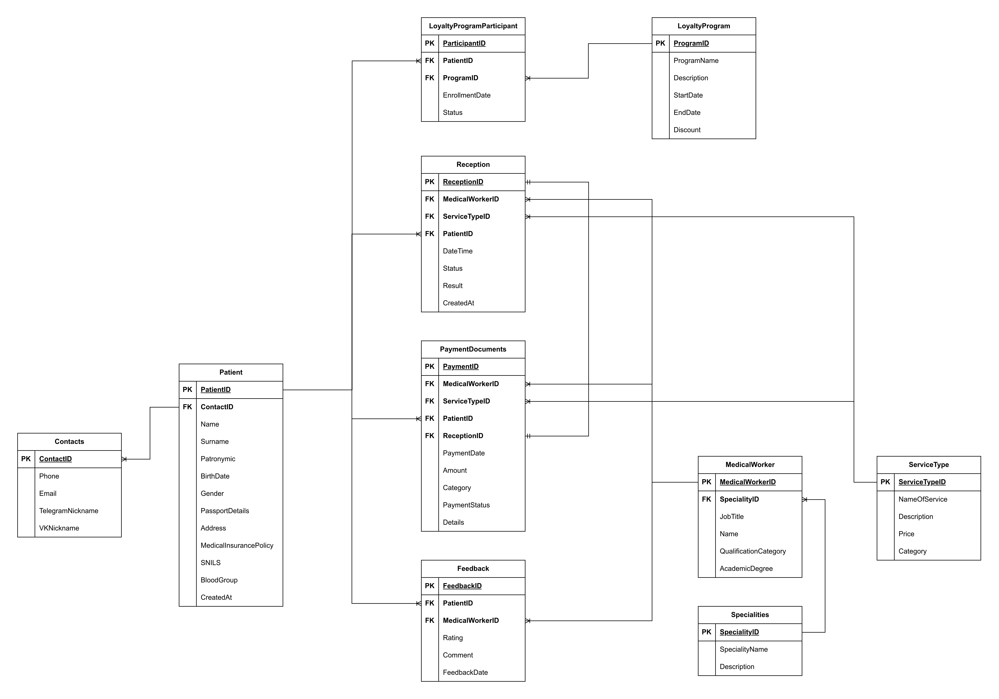

# CommercialPolyclinic-DB

## Описание

В данном репозитории представлена реализация Базы Данных для произвольной Коммерческой Поликлиники на СУБД `Microsoft SQL Server` со встроенным функционалом, описанным ниже.

Для запуска СУБД использовался `Docker`, инструкция по развёртыванию располагается [здесь](https://github.com/Ivan-Knyazev/MSSQL_Docker).

## Требования

БД должна позволять осуществлять:
* ведение медицинских карт пациентов (посещения лечащих врачей,
направления на анализы, процедуры);
* ведение перечня медперсонала с учетом их категории и наличия учёной
степени;
* ведение очередей на приём к специалистам по направлениям лечащих врачей;
* формирование документов на оплату медицинских услуг с учетом категории
осмотра (первичный, повторный), категории и наличия ученой степени
лечащего врача;
* ведение прейскуранта услуг.

## Характеристики разработанной Базы Данных

Схема созданной БД:

Написаны скрипты для создания всех таблиц - `create_db_tables.sql` и для заполнения случайно сгенерированными данными всех созданных таблиц - `insert_data_to_tables.sql`. Данные скрипты расположены в директории `./init_db`.

База Данных удовлетворяет <i>3 Нормальной Форме</i> и не содержит аномалий. Все скрипты написаны на `Transact-SQL` `(T-SQL)`, который необходим для СУБД `MS-SQL` (её использование объясняется требованиям к работе).

### Реализованные объекты БД:

<b>Представления</b> и тесты к ним:
1) получение полной информации по пациенту;
2) получение полной информации о проведённых приёмах с указанием стоимости, результата, информации о враче и типе услуги;
3) получение всех записей на приёмы на сегодняшний день - электронная очередь;
4) получение среднего рейтинга на основе отзывов по всем врачам (для пользователей и аналитики).

<b>Функции</b> и тесты к ним:
1) получение очереди по записям к какому-то конкретному врачу на сегодняшний день через вызов представления "получение записей на приёмы на сегодняшний день";
2) получение истории посещения врачей по определённому клиенту;
3) получение предстоящих записей к врачам по определённому клиенту;
4) получение списка чеков по какому-то врачу;
5) получение средней стоимости чека по всем типам услуг (для аналитики).

<b>Процедуры</b> и тесты к ним:
1) добавление нового пациента с обработкой контактных данных;
2) выписка чека по какому-то приёму с учётом скидки;
3) обновление статуса приёма в конце дня (установка статуса "отменён" для тех, кто не пришёл);
4) обновление статуса участия в программе лояльности на "неактивен", если вышел срок действия программы.

<b>Триггеры</b> и тесты к ним:
1) запуск процедуры на выписку чека с учётом скидки, если она есть, по изменению статуса приёма на "Завершен" + проверка краевых случаев (если стутус уже был "Завершен" или запись не была отменена);
2) при написании отзыва проверка на то, что пациент действительно был у данного врача;
3) при создании записи - проверка на запись на одно и то же время к одному и тому же врачу + проверка даты на то, что запись не в прошлое.

+ Все триггеры написаны с обработки исключений и использованием <i>курсоров</i> для обработки массива изменяемых/добавляемых в БД записей.

Скрипты для создания всех описанных выше объектов располагаются в директории `./create_db_objects`.

Разработка данного проекта происходила в рамках выполнения курсовой работы по дисциплине "<b>Базы данных</b>" в <b>НИТУ МИСИС</b> на 3 семестре осенью 2024 года.